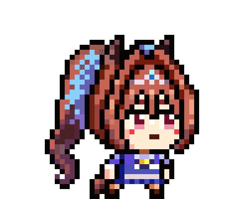
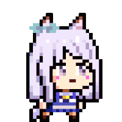

<!-- Modern Hero Section -->
<h1>
  
</h1>

<!-- Uma Musume Pixel Art Gallery -->
<table border="0">
  <tr>
    <td align="center"></td>
    <td align="center"></td>
    <td align="center"></td>
    <td align="center"></td>
  </tr>
</table>

 

<!-- Activity Graph -->

<!-- Stats Grid: Two Column Layout -->
<table>
  <tr>
    <td width="50%">
      
    </td>
    <td width="50%">
      
    </td>
  </tr>
</table>

<!-- Compact Social Links -->

  
  
  

<!-- Minimal End -->

